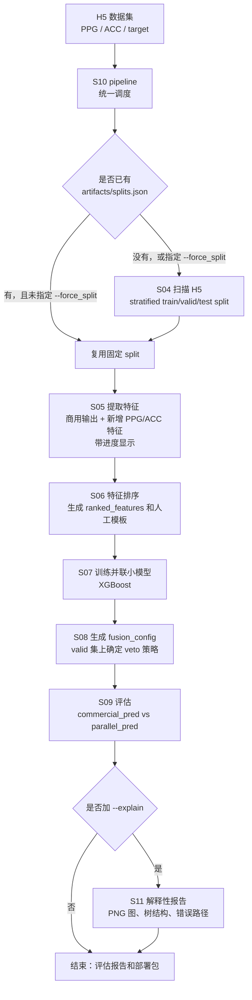
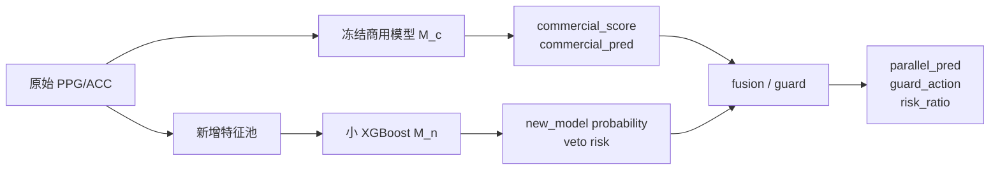
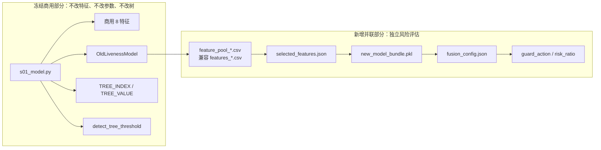
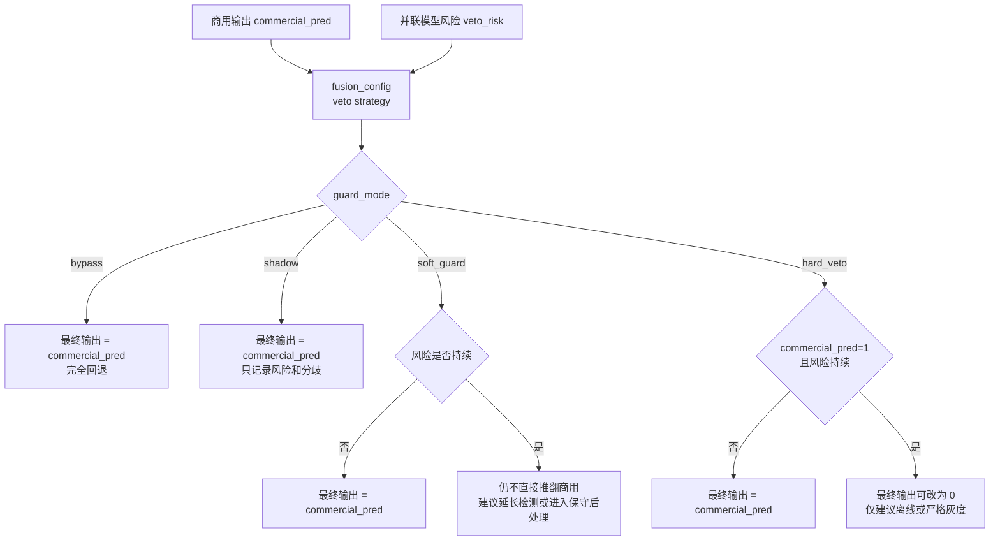
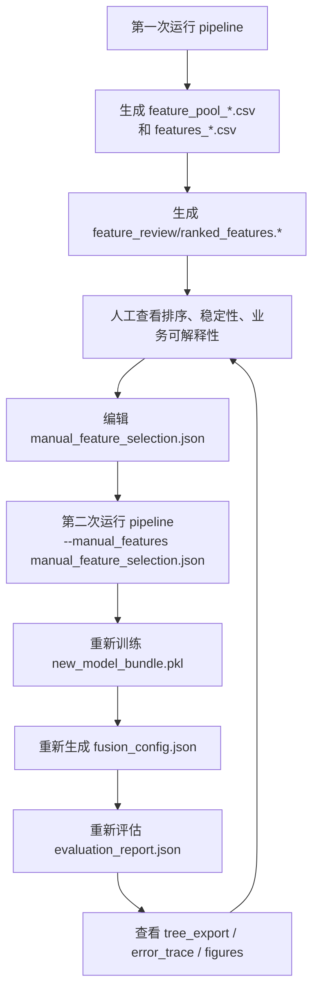
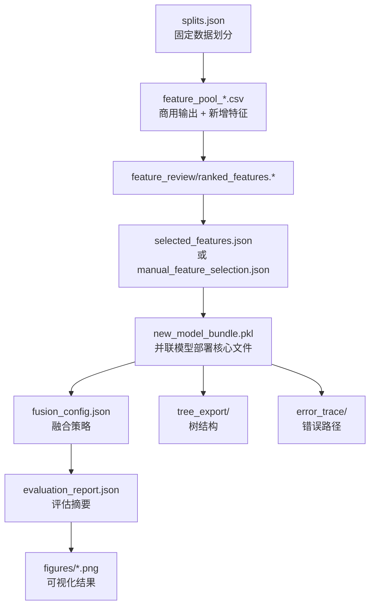

# Parallel 并联商用守护方案

`parallel/` 是一个可以单独拷走运行的并联方案，用于基于 PPG/ACC 的手表佩戴活体检测。它的核心原则是：**完全保留现有商用特征、商用模型参数和商用推理逻辑，同时训练一个独立的小型 XGBoost 模型，用于风险复核、shadow 分析和可解释性研究**。

这个方案更适合做数据分析、特征研究、样本分布分析和独立风险评估。相比 `cascade`，它不只关注商用阳性错误候选，而是会在所有窗口上训练和评估一个并联模型。

## 新手快速开始

如果你第一次接触这个项目，先按这一节跑通最小流程，再看后面的原理、特征分析和可解释性报告。

### 1. 准备目录

把整个 `parallel/` 文件夹拷贝到任意位置都可以运行。推荐目录关系如下：

```text
your_workspace/
    parallel/
        s01_model.py
        s10_pipeline.py
        README.md
        ...
    dataset/
        sample_001.h5
        sample_002.h5
        ...
```

`dataset/` 不一定要放在 `parallel/` 旁边，也可以放在任意磁盘路径，运行时用 `--dataset_dir` 指向它即可。

### 2. 安装 Python 依赖

建议使用 Python 3.9+。在你的 Python 环境中安装：

```bash
pip install numpy pandas scipy scikit-learn xgboost h5py joblib matplotlib
```

可选安装 Graphviz，用于把树结构导出为 PNG。如果没有 Graphviz，项目仍然会输出 `tree_*.json`、`tree_*.dot` 和 `all_trees.txt`。

### 3. 先做 dry-run

进入 `parallel/` 目录：

```bash
cd path\to\parallel
```

先检查命令链路，不真正跑数据：

```bash
python s10_pipeline.py --dataset_dir path\to\dataset --dry_run
```

如果 dry-run 能打印 S05/S06/S07/S08/S09 的命令，说明入口脚本和参数基本正常。

### 4. 跑最小完整流程

推荐先用 `shadow`，因为它不会改变商用输出，只记录并联模型风险：

```bash
python s10_pipeline.py --dataset_dir path\to\dataset --guard_mode shadow
```

需要解释性图片和树结构时再加：

```bash
python s10_pipeline.py --dataset_dir path\to\dataset --guard_mode shadow --explain
```

需要额外生成特征池可解释性汇报图时再加：

```bash
python s10_pipeline.py --dataset_dir path\to\dataset --guard_mode shadow --feature_report
```

运行结束后先看这几个文件：

```text
artifacts/parallel/commercial_model_manifest.json
artifacts/parallel/features_train.csv
artifacts/parallel/feature_pool_train.csv
artifacts/parallel/model_fingerprint.json
artifacts/parallel/feature_report/
artifacts/parallel/evaluation_report.json
artifacts/parallel/evaluation_comparison.csv
artifacts/parallel/feature_review/ranked_features.md
artifacts/parallel/fusion_config.json
```

需要交给工程化同事时，导出独立部署包：

```bash
python s12_export_deploy.py --artifact_dir artifacts/parallel
```

默认会生成：

```text
artifacts/parallel/deploy_export/
```

### 5. 最重要的理解

- `commercial_pred`：只依赖原商用模型的结果。
- `parallel_pred`：商用模型旁边增加并联风险模型后的完整方案结果。
- `feature_pool_*.csv`：并联方案的标准窗口级特征池缓存，保存商用输出和新增 PPG/ACC 特征。
- `features_*.csv`：兼容旧流程的同内容文件；新脚本会优先读取 `feature_pool_*.csv`，不存在时再回退到 `features_*.csv`。
- `shadow`：只记录风险，不改变最终输出。
- `fusion_config.json`：记录并联模型如何参与风险复核。
- `commercial_model_manifest.json`：证明商用特征和模型参数没有被修改。

## 0. 先看这一节：如何理解整个项目

这一节用于快速建立全局认识。后面的章节会逐个解释代码文件、参数、产物和使用方法。

### 0.1 一句话理解 parallel

`parallel` 不是替换商用模型，而是在商用模型旁边训练一个独立的小模型，用来做风险复核、数据分布分析和可解释性研究。

```text
商用模型仍然完整保留。
并联小模型独立提取 PPG/ACC 特征，给出非佩戴风险。
默认 shadow 模式只记录风险，不改变商用最终输出。
```

### 0.2 端到端运行流程图



关键点：

- split 在 `S05` 之前完成。`S10` 会先生成或复用 `splits.json`，然后才提取特征。
- 如果已经存在 `splits.json`，默认不会重新划分，所以日志中会显示复用 split。
- `S05` 时间较长，因为它要逐样本、逐窗口提取商用输出和新增特征；当前已经增加进度输出，并支持按样本并行。
- `S05` 的并行策略是保守的：默认小于 32 个样本的 split 仍串行，避免 Windows 多进程启动开销；样本数较大时自动启用最多 4 个 worker，也可以通过 `--n_workers` 显式指定。
- `S09` 评估会优先复用 `features_{split}.csv`。如果缓存特征存在，就不再重复读取 H5 和重新抽取窗口特征；只有缓存缺失时才回退到原始 H5 评估路径。

### 0.3 商用模型和并联模型的数据流



并联方案比串联方案更适合做研究分析，因为它会在所有可提取窗口上形成特征池，而不是只看商用阳性候选。

### 0.4 商用模型冻结边界图



验收时优先看：

```text
artifacts/parallel/commercial_model_manifest.json
```

其中 `frozen=true`，并且 `tree_index_sha256`、`tree_value_sha256` 不变，说明商用模型参数保持冻结。

### 0.5 fusion 和 guard 决策图



推荐顺序：

```text
先 shadow -> 用数据验证风险分布 -> 再考虑 soft_guard -> 最后才考虑 hard_veto
```

### 0.6 人工特征选择闭环图



这个闭环的目的不是追求训练集指标最高，而是让新增特征满足：

- 能解释。
- 能部署。
- 在 train/valid/test 上表现一致。
- 不依赖标签泄漏字段。
- 能帮助理解误判佩戴、误拒、模型分歧和数据分布。

### 0.7 产物关系和部署文件图



最终部署或交付时，至少保留：

```text
commercial_model_manifest.json
splits.json
feature_pool_train.csv
feature_pool_valid.csv
feature_pool_test.csv
features_train.csv
features_valid.csv
features_test.csv
selected_features.json
feature_review/manual_feature_selection.json
new_model.json
new_model_bundle.pkl
fusion_config.json
evaluation_report.json
evaluation_comparison.csv
figures/*.png
tree_export/*
error_trace/*
```

注意：`tree_*.png` 依赖系统安装 Graphviz `dot`。如果没有 Graphviz，项目仍会输出 `tree_*.json`、`tree_*.dot` 和 `all_trees.txt`，可解释信息不会丢失。

## 1. 项目定位

并联方案的推理路径是：

```text
原始 PPG/ACC 数据
    -> 冻结商用模型 M_c，得到 commercial_pred / commercial_score
    -> 独立轻量模型 M_n，得到 new_model probability / veto risk
    -> 融合策略 fusion
    -> 输出 parallel_pred / guard_action / risk_ratio
```

设计目标：

- 保持商用模型 `s01_model.py` 不变。
- 保持商用 8 个特征不变。
- 保持商用 AdaBoost 树结构、阈值、后处理延迟参数不变。
- 并联训练一个独立小模型，用于判断非佩戴风险。
- 默认 `shadow` 模式只记录风险，不改变最终输出。
- 输出丰富的样本、特征、树结构和错误路径分析材料。

## 2. 与 cascade 的区别

`cascade` 是串联方案：只在商用模型判为佩戴之后做后置风险复核。

`parallel` 是并联方案：独立模型在所有窗口上提取特征和训练，再通过融合策略参与风险判断。

对比：

| 项目 | cascade | parallel |
| --- | --- | --- |
| 训练数据 | 商用阳性候选 | 所有可提取窗口 |
| 商用叙事 | 后置安全复核 | 独立风险评估 |
| 商用保守性 | 更高 | 中等 |
| 数据分析能力 | 聚焦 hard negative | 更适合全局样本/特征分析 |
| 首版上线建议 | 更推荐 | 更适合 shadow 和研究 |

如果目标是最小商业风险，优先看 `cascade`。
如果目标是理解数据分布、特征有效性、错误样本规律，`parallel` 更有价值。

## 3. 独立运行边界

这个文件夹是独立项目。把整个 `parallel/` 文件夹拷贝到其他位置后，只要有数据集和 Python 环境，就可以直接运行。

它不依赖父目录 `new_codex_1` 中的脚本，不从 `cascade/` 导入代码，也不要求两个项目同时存在。

运行时仍需要外部输入：

- H5 数据集目录，通过 `--dataset_dir` 指定。
- Python 包：`numpy`、`pandas`、`scikit-learn`、`xgboost`、`h5py`、`joblib`、`matplotlib`、`scipy`。
- 可选 Graphviz `dot`，用于把 XGBoost 树导出为 PNG 图片。如果没有 Graphviz，仍会保留 JSON/DOT/TXT 树结构文件。

默认输出在当前文件夹下：

```text
parallel/artifacts/
```

其中：

```text
artifacts/splits.json
artifacts/parallel/*
```

## 4. 商用模型冻结约束

商用模型位于：

```text
s01_model.py
```

它包含：

- 商用 8 个特征名：`feature_names`。
- 商用 AdaBoost 参数：`tree_num`、`tree_node`、`detect_tree_threshold`。
- 商用树数组：`TREE_INDEX`、`TREE_VALUE`。
- 商用逻辑判断阈值：`good_corr_threshold`、`good_ac_threshold` 等。
- 商用状态延迟：`live_flag_delay`、`un_live_flag_delay`。
- 商用窗口：`commercial_win_sec=5`、`commercial_stride_sec=1`。
- Stage1 门控参数。

运行 `s05_extract_features.py` 时会生成：

```text
artifacts/parallel/commercial_model_manifest.json
```

这个 manifest 用于验收商用模型是否被冻结，关键字段包括：

```text
model_name = frozen_commercial_adaboost
feature_names
tree_num
tree_node
detect_tree_threshold
stage1_primitive_sec
stage1_decision_sec
stage1_fs
stage1_gate_k
tree_index_sha256
tree_value_sha256
frozen = true
```

验收时应确认：

- `frozen` 是 `true`。
- `tree_index_sha256` 和 `tree_value_sha256` 没有变化。
- `feature_names` 没有变化。
- 并联模型训练不修改商用模型和商用特征提取。

## 5. 数据格式

数据目录中应包含 `.h5` 文件。

支持两类 H5 样本结构：

1. 普通样本 group：

```text
sample_xxx/
    ppg
    target
    acc          可选
```

2. grouped-window 样本：

```text
sample_xxx/
    xxx_w20_1/
        ppg
        acc      可选
    xxx_w20_2/
        ppg
        acc      可选
```

支持的 PPG shape：

```text
(40, T)
(N_windows, 40, T_window)
```

`target` 约定：

```text
0 = 非佩戴 / 攻击 / 负样本
1 = 正常佩戴 / 正样本
```

## 6. split 方法

split 逻辑在：

```text
s04_data.py
```

默认参数：

```text
valid_size = 0.15
test_size = 0.15
random_state = 42
```

切分方式：

- 扫描数据集中的所有 H5 文件。
- 按样本读取 `target`。
- 使用 stratified split，保持 train/valid/test 中正负样本比例尽量一致。
- 第一次运行时写入 `artifacts/splits.json`。
- 后续运行默认复用已有 `splits.json`。
- 如果需要重新切分，使用 `--force_split`。

命令：

```bash
python s10_pipeline.py --dataset_dir D:\wearing_liveness\dataset --force_split
```

## 7. 代码结构

### `s01_model.py`

冻结商用模型模块。

主要内容：

- `FEATURE_NAMES`：商用 8 个特征。
- `TREE_INDEX`、`TREE_VALUE`：商用 AdaBoost 树。
- `OldLivenessModel`：商用模型推理类。
- `CommercialStage1Gate`：Stage1 门控。
- `extract_8_commercial_features()`：商用 8 特征提取。
- `commercial_model_manifest()`：冻结模型验收 manifest。

这份文件是商用基线，不应随新增并联模型修改。

### `s02_features.py`

PPG/ACC 特征提取模块。

主要内容：

- PPG 预处理。
- 绿光、环境光、IR、ACC 特征。
- Stage1 阈值配置。
- 部署友好特征白名单。
- 特征池生成工具。

新增特征池当前采用“可解释性优先”的过滤策略。绿光 PPG 会先形成三路输入 `g1/g2/g3`：普通三绿光数据直接取三个绿光通道；多路绿光数据会按同一物理位置的多颗绿光求平均，合并成 3 个方位通道。后续新增模型主要使用以下几类容易解释的特征：

- 绿光强度和稳定性：例如 `G_mean_mean`、`GREEN_AC_MAD`、`GREEN_AC_DC_RATIO`、`GREEN_SEG_ACDC_CV`。
- 三通道一致性：例如 `G_ch_dc_cv`、`GCH_DC_RANGE_RATIO`、`GCH_AC_RANGE_RATIO`、`G_2OF3_AC_SUPPORT`、`G_TOP2_CORR_MIN`。
- TOP2 绿光聚合：用三通道中 AC 更好的两路形成稳健绿光，保留 `GTOP2_AC_MAD`、`GTOP2_AC_DC_RATIO`、`GTOP2_SEG_ACDC_CV` 等。
- 环境光关系：例如 `AMB_AC_TO_GREEN_AC`、`AMB_DC_TO_GREEN_DC`、`GREEN_AMB_BP_CORR`、`GREEN_AMB_LEAK`，用于解释“外界光泄漏/遮挡变化”。
- ACC 运动强度：例如 `ACC_MAG_STD`、`ACC_DIFF_MAD`、`ACC_STILL_SCORE`、`ACC_GREEN_BP_CORR`，用于解释“静止/运动与 PPG 是否匹配”。

为了让后续树模型和汇报材料更容易解释，当前会从新增候选池和部署白名单中剔除以下特征族：

- 熵类和 Hjorth 类：如 `*_Entropy_*`、`*_Hjorth_*`，数学含义偏抽象，不利于业务解释。
- 偏度/峰度类：如 `*_bp_skewness`、`*_bp_kurtosis`，对异常波形敏感，阈值不好解释。
- 空间向量几何类：如 `G_spatial_vmag_*`、`G_SPATIAL_VMAG_RANGE`，三通道合并后更推荐用通道差异、相关性和支持数解释。
- 硬件编号/角度类：如 `G_MIN_CHANNEL_ID`、`G_DROPOUT_ANGLE`、`G_TOP2_WORST_IDX`，容易绑定设备布局。
- 复合打分类：如 `G_SPATIAL_STABILITY_SCORE`、`ACC_STILL_GREEN_MISMATCH`，由多个概念相乘或相除，难以在上线评审中解释单一物理意义。

人工选择特征时，建议优先选择能用一句话解释的特征，例如“绿光 AC/DC 太低”“三通道只有 1 路支持”“环境光和绿光同步泄漏”“ACC 很静止但 PPG 不稳定”。如果一个特征必须依赖复杂数学概念才能解释，即使排序靠前，也不建议进入最终小 XGBoost。

当前 Stage1 默认阈值：

```text
DEFAULT_STAGE1_DC_THRESHOLD = 0.3e6
DEFAULT_STAGE1_AC_DC_THRESHOLD = 1.0
```

### `s03_selection.py`

高级特征分析和可视化工具。

主要能力：

- 特征稳定性分析。
- VIF / 相关性分析。
- PCA、t-SNE、UMAP 嵌入图。
- 特征分布图。
- 特征排序报告。

当前图片策略：只输出高清 PNG。

### `s04_data.py`

数据扫描和 split 工具。

主要能力：

- 扫描 H5 文件。
- 兼容普通样本和 grouped-window 样本。
- 生成 train/valid/test。
- 保存和读取 `splits.json`。

### `s05_extract_features.py`

并联方案的特征提取入口。

它会对 train/valid/test 中的样本提取：

- 商用模型输出。
- 商用相关分数。
- 新增 PPG/ACC 特征。
- 窗口级标签。

输出：

```text
artifacts/parallel/commercial_model_manifest.json
artifacts/parallel/features_train.csv
artifacts/parallel/features_valid.csv
artifacts/parallel/features_test.csv
artifacts/parallel/feature_pool_train.csv
artifacts/parallel/feature_pool_valid.csv
artifacts/parallel/feature_pool_test.csv
```

### `s06_select_features.py`

为并联小模型选择特征。

特点：

- 只从数值特征中选。
- 自动排除标签、预测结果和泄漏字段。
- 输出 ranked feature 和人工选择模板。
- 支持 `--n_workers`，会传入底层稳定性选择的 fold 任务；运行时会打印每个 fold 的进度。
- 支持输入哈希缓存。若 `feature_pool_train.csv`、`feature_pool_valid.csv` 和关键参数未变化，会直接复用 `selected_features.json` 与 `feature_review/`，跳过耗时的稳定性选择；旧的 `features_*.csv` 仍作为兜底兼容。
- 默认采用快速筛选配置：`--preselect_top 4 --stability_splits 4 --stability_seeds 1,7 --stability_max_rows 5000`。它参考了 `new_new` 的加速思路，先压缩候选特征和训练行数，再做稳定性选择。
- 支持 `--rank_only`，只做特征清洗、组内预筛和排序报告，不跑稳定性选择。这个模式适合先快速得到 `ranked_features.csv`，再由人工决定哪些特征可用于训练。
- 支持 `--permutation_repeats` 控制稳定性选择中 permutation importance 的重复次数。默认 `3` 更稳，快速探索可设为 `1`。
- 如果要恢复更严格但更慢的旧配置，可以使用：`--preselect_top 6 --stability_splits 5 --stability_seeds 1,7,42 --stability_max_rows 0`。

输出：

```text
artifacts/parallel/selected_features.json
artifacts/parallel/feature_review/ranked_features.csv
artifacts/parallel/feature_review/ranked_features.json
artifacts/parallel/feature_review/ranked_features.md
artifacts/parallel/feature_review/manual_feature_selection_template.json
artifacts/parallel/feature_review/selection_cache.json
```

### `s07_train_model.py`

训练并联小模型。

默认模型：

```text
XGBoost
n_estimators = 10
max_depth = 2
```

输出：

```text
artifacts/parallel/new_model.json
artifacts/parallel/new_model_bundle.pkl
```

部署包中包含：

- 模型对象。
- 选择的特征。
- 缺失值填充值。
- 阈值。
- 特征来源。

### `s08_fusion.py`

生成融合配置。

当前策略：

```text
strategy = veto
```

它会在 valid 集上比较：

- 商用模型。
- 新并联模型。
- veto 融合策略。

输出：

```text
artifacts/parallel/fusion_config.json
```

### `s09_evaluate.py`

评估商用基线和完整并联方案。

输出：

```text
artifacts/parallel/evaluation_report.json
artifacts/parallel/evaluation_samples.csv
artifacts/parallel/evaluation_comparison.csv
artifacts/parallel/evaluation_confusion_matrices.csv
```

核心对比：

```text
commercial_pred  只依赖商用模型的输出
parallel_pred    当前完整并联方案输出
bypass_pred      回退模式输出，等于商用输出
```

运行时会优先读取：

```text
artifacts/parallel/features_{split}.csv
```

这可以复用 `S05` 已经生成的窗口级特征池，避免 `S09` 再次走 H5 读取和特征抽取慢路径。如果该文件不存在，脚本仍会保留原始 H5 回退评估路径。

### `s10_pipeline.py`

一键运行脚本。

它串联执行：

```text
自动生成或读取 splits.json
S05 提取商用输出和新增特征
S06 选择特征，可通过 --n_workers、--rank_only、--permutation_repeats 加速
S07 训练并联小模型
S08 生成 fusion 配置
S09 评估
S11 可解释性报告，可选
```

### `s11_explain.py`

解释性报告脚本。

输出内容：

- 商用模型 vs 完整方案指标对比。
- 样本流转 funnel。
- 错误样本分布图。
- XGBoost 树结构导出。
- 错误样本经过了哪些树节点。

`--plot_mode basic` 只生成指标对比、样本流转、错误分布、风险样本和特征排序图，跳过树导出和错误路径追踪，适合快速检查和日常迭代。默认 `--plot_mode full` 保留完整解释性产物，适合整理汇报材料。

输出目录：

```text
artifacts/parallel/figures/*.png
artifacts/parallel/tree_export/*
artifacts/parallel/error_trace/*
```

### `s12_export_deploy.py`

部署交接包导出脚本。它把训练产物、融合策略和部署参考脚本整理成一个可独立传递的目录：

```text
artifacts/parallel/deploy_export/
```

主要输出：

```text
model.json
method.json
selected_features.json
fill_values.json
commercial_model_manifest.json
feature_extractor.py
s02_features.py
commercial_model.py
deploy_inference.py
README_DEPLOY.md
deploy_manifest.json
```

`method.json` 是核心方法配置，包含特征顺序、缺失值填充值、阈值、guard 模式、训练 fingerprint、并联 fusion/veto 策略和商用模型冻结信息。

### `s13_feature_report.py`

特征池可解释性报告脚本。它只读取 `feature_pool_test.csv` 和 `selected_features.json`，不参与训练或调参，适合整理汇报材料。

输出：

```text
artifacts/parallel/feature_report/feature_auc_ranking.csv
artifacts/parallel/feature_report/feature_auc_ranking.png
artifacts/parallel/feature_report/pca_2d.png
artifacts/parallel/feature_report/selected_feature_correlation.png
artifacts/parallel/feature_report/feature_report_summary.json
```

## 8. 快速运行

进入项目目录：

```bash
cd D:\wearing_liveness\new\new_codex_1\parallel
```

只检查命令和路径，不实际运行：

```bash
python s10_pipeline.py --dataset_dir D:\wearing_liveness\dataset --dry_run
```

完整运行 shadow 模式，并生成解释性报告：

```bash
python s10_pipeline.py --dataset_dir D:\wearing_liveness\dataset --guard_mode shadow --explain
```

指定 worker 数运行。`--n_workers` 会用于首次扫描 H5 数据，也会传给 `S05` 做样本级并行，并传给 `S06` 加速稳定性选择：

```bash
python s10_pipeline.py --dataset_dir D:\wearing_liveness\dataset --guard_mode shadow --n_workers 4
```

并行策略是保守设计，适合在 Windows、Linux 和服务器环境中稳定运行：

- `S05` 按完整 H5 样本并行提取商用输出和新增 PPG/ACC 特征，不按窗口切分，避免同一个样本被反复读取。
- 样本数量较小时保持串行，避免多进程启动成本超过收益。
- 大样本场景下会自动使用 `executor.map(..., chunksize=...)` 降低大量 future 调度开销。
- 每个 worker 内会限制 BLAS/NumExpr 线程数，避免 `多进程 x 多线程` 抢占 CPU 导致变慢。
- 稳定性选择阶段会把训练矩阵一次性放入 worker，全局复用，只在 fold 任务中传索引，减少重复序列化。

特征筛选和稳定性选择耗时很长时，可以显式使用快速配置：

```bash
python s10_pipeline.py --dataset_dir D:\wearing_liveness\dataset --guard_mode shadow --n_workers 4 --preselect_top 4 --stability_splits 4 --stability_seeds 1,7 --stability_max_rows 5000
```

如果当前目标只是先得到特征排序和人工选择模板，建议使用更快的排序模式：

```bash
python s10_pipeline.py --dataset_dir D:\wearing_liveness\dataset --guard_mode shadow --n_workers 4 --rank_only --permutation_repeats 1
```

如果需要解释性图片但暂时不需要树结构和错误路径细节，可以使用 basic 绘图模式：

```bash
python s10_pipeline.py --dataset_dir D:\wearing_liveness\dataset --guard_mode shadow --explain --plot_mode basic
```

如果某一步产物已经存在，可以用 `-skip` 或 `--skip` 跳过指定阶段。支持阶段号、脚本名和逗号分隔写法：

```bash
python s10_pipeline.py --dataset_dir D:\wearing_liveness\dataset --guard_mode shadow -skip s06
python s10_pipeline.py --dataset_dir D:\wearing_liveness\dataset --guard_mode shadow --explain --skip s06,s11_explain.py
```

注意：跳过某阶段前要确认后续阶段依赖的产物已经存在。例如跳过 `S06` 时，应已有 `selected_features.json`；跳过 `S05` 时，应已有 `feature_pool_train.csv`、`feature_pool_valid.csv` 和 `feature_pool_test.csv`，或旧版兼容文件 `features_train.csv`、`features_valid.csv`、`features_test.csv`。

如果要离线做更充分的排序复核，可以恢复旧的严格配置：

```bash
python s10_pipeline.py --dataset_dir D:\wearing_liveness\dataset --guard_mode shadow --n_workers 4 --preselect_top 6 --stability_splits 5 --stability_seeds 1,7,42 --stability_max_rows 0
```

如果数据量较小，建议保持默认或显式使用串行，避免多进程启动开销：

```bash
python s10_pipeline.py --dataset_dir D:\wearing_liveness\dataset --guard_mode shadow --n_workers 1
```

重新生成 split：

```bash
python s10_pipeline.py --dataset_dir D:\wearing_liveness\dataset --force_split
```

指定输出目录，避免覆盖已有结果：

```bash
python s10_pipeline.py --dataset_dir D:\wearing_liveness\dataset --splits_dir artifacts_run_001 --artifact_dir artifacts_run_001\parallel --force_split --guard_mode shadow --explain
```

限制调试样本数：

```bash
python s10_pipeline.py --dataset_dir D:\wearing_liveness\dataset --max_samples 20 --guard_mode shadow
```

## 9. Guard 模式

支持 4 种模式：

```text
bypass
shadow
soft_guard
hard_veto
```

### `bypass`

最终输出完全等于商用输出。

用途：

- 回退验证。
- 确认新增逻辑不会影响商用结果。

### `shadow`

默认模式。

最终输出仍等于商用输出，但记录并联模型风险：

```text
final_pred = commercial_pred
```

用途：

- 线上静默观察。
- 收集 disagreement。
- 分析新模型和商用模型的分歧。

### `soft_guard`

最终分类仍不直接推翻商用输出，但当风险持续出现时，建议延长检测或进入更保守后处理。

用途：

- 比 hard veto 更温和。
- 适合先做体验风险较低的灰度。

### `hard_veto`

当风险满足持续条件时，可以把商用阳性改为阴性：

```text
commercial_pred = 1
risk_count >= min_veto_windows
risk_ratio >= min_veto_ratio
```

默认持续条件：

```text
min_veto_windows = 2
min_veto_ratio = 0.4
```

注意：`hard_veto` 不建议直接全量商用，应该只用于离线评估或严格灰度。

## 10. 手工特征选择

自动特征筛选后会生成模板：

```text
artifacts/parallel/feature_review/manual_feature_selection_template.json
```

人工确认后，另存为：

```text
artifacts/parallel/feature_review/manual_feature_selection.json
```

然后运行：

```bash
python s10_pipeline.py --dataset_dir D:\wearing_liveness\dataset --manual_features artifacts/parallel/feature_review/manual_feature_selection.json
```

训练脚本会拒绝标签泄漏字段，例如：

```text
target
should_veto
commercial_pred
is_error
fallback
```

## 11. 主要输出解释

### `commercial_model_manifest.json`

商用模型冻结证据。用于确认商用模型参数、特征名和树结构哈希没有变化。

### `model_fingerprint.json`

新增并联模型的训练来源记录。包含训练时间、Python/numpy/pandas/xgboost 版本、`splits.json` 的 SHA256 摘要、`feature_pool_train.csv` 的 SHA256 摘要，以及 `test_used_for_selection=false` 的数据使用策略。部署导出时会一起写入 `method.json` 并拷贝到 `deploy_export/`。

### `feature_pool_*.csv` 和 `features_*.csv`

并联模型的窗口级特征池缓存。包含商用输出、新增 PPG/ACC 特征、样本名、标签和窗口位置。

`S05` 会同时写出两套文件名：

- `feature_pool_train.csv`、`feature_pool_valid.csv`、`feature_pool_test.csv`：推荐的新标准名。
- `features_train.csv`、`features_valid.csv`、`features_test.csv`：兼容旧脚本和旧产物。

后续 `S06` 特征选择、`S07` 训练、`S08` 融合和 `S09` 评估都会优先读取 `feature_pool_*.csv`；如果不存在，再回退读取 `features_*.csv`。因此只要 `feature_pool_*.csv` 已经存在，重复调参时可以用 `-skip s05` 跳过最耗时的 H5 读取和特征抽取。

### `feature_report/`

特征池解释性报告。重点看：

- `feature_auc_ranking.csv/png`：单特征区分度排序。
- `pca_2d.png`：测试集样本在特征空间中的二维分布。
- `selected_feature_correlation.png`：入选特征之间的相关性，辅助判断是否过度依赖重复信息。

### `feature_review/`

特征排序和人工选择材料。用于解释为什么选择某些特征进入新增小模型。

### `new_model_bundle.pkl`

并联小模型部署包，包含：

- 模型对象。
- 选择的特征。
- 缺失值填充值。
- 阈值。
- 特征来源。

### `fusion_config.json`

融合配置，记录当前采用的策略和阈值。

### `evaluation_report.json`

评估摘要，包含商用基线和完整方案指标。

### `evaluation_samples.csv`

样本级评估明细。用于查看每个样本的：

- 商用输出。
- 并联方案输出。
- veto risk。
- guard action。
- risk ratio。
- 是否 fallback。

### `evaluation_confusion_matrices.csv`

0/1 样本混淆矩阵，行是真实标签，列是预测标签：

```text
model,true_label,pred_0,pred_1
commercial,0,TN,FP
commercial,1,FN,TP
parallel,0,TN,FP
parallel,1,FN,TP
```

`S09` 运行时也会在终端打印商用基线和并联完整方案的矩阵，便于直接比较并联风险复核是否减少 `true_label=0, pred_1` 的误判佩戴。

### `tree_export/`

模型树结构导出：

- `all_trees.txt`
- `tree_*.json`
- `tree_*.dot`
- `tree_*.png`，需要 Graphviz。
- `model_structure_summary.csv`

### `error_trace/`

错误样本路径追踪：

- `error_samples.csv`
- `error_tree_paths.csv`
- `error_escape_rules.csv`
- `error_escape_rules.md`
- `error_path_node_frequency.png`

用于回答：错误样本是在哪些树节点、哪些分支上逃出的。

### `deploy_export/`

端侧或工程化交接目录。重点文件：

- `model.json`：新增并联 XGBoost 模型。
- `method.json`：完整部署方法配置，包含 fusion/veto 参数。
- `feature_extractor.py`：部署参考特征提取脚本。
- `s02_features.py`：兼容文件名，保证 `commercial_model.py` 内部导入可用。
- `commercial_model.py`：冻结商用模型脚本。
- `commercial_model_manifest.json`：商用冻结证据。
- `deploy_inference.py`：最小 Python 推理参考。
- `deploy_manifest.json`：文件清单和 SHA256。

导出命令：

```bash
python s12_export_deploy.py --artifact_dir artifacts/parallel
```

## 12. 推荐使用路径

建议使用并联方案做分析和 shadow：

1. 使用 `shadow` 模式跑线上或离线数据。
2. 查看 `feature_review/`，判断哪些 PPG/ACC 特征稳定、可解释、可部署。
3. 查看 `figures/`，理解错误样本和风险样本分布。
4. 查看 `tree_export/`，确认并联小模型树结构是否简单可解释。
5. 查看 `error_trace/`，分析错误样本集中经过哪些分支节点。
6. 与 `cascade` 方案对比，再决定是否进入 `soft_guard` 或 `hard_veto` 灰度。

## 13. 当前验收结论

当前项目满足：

- 可单独拷贝运行。
- 不依赖 `cascade/` 或父目录脚本。
- 商用模型以 manifest 记录冻结证据。
- 默认 `shadow` 不改变最终商用输出。
- 支持商用基线和完整方案的准确率对比。
- 支持高分辨率 PNG 图片输出。
- 支持树结构可视化和错误样本路径追踪。
- 支持人工特征选择。
- 适合做数据分布、样本错误和特征可解释性分析。

## 附录 A：数据/特征完整报告与人工特征闭环

本项目已经具备数据分析、特征排序、人工特征确认、重新训练和可解释性复核的闭环能力。这里的“完整报告”不是单个文件，而是一组围绕样本、特征、模型和错误路径的产物。

### A.1 当前会自动生成哪些报告

运行完整 pipeline 并打开 `--explain` 后：

```bash
python s10_pipeline.py --dataset_dir D:\wearing_liveness\dataset --guard_mode shadow --explain
```

会生成以下几类报告。

#### 1. 数据切分报告

位置：

```text
artifacts/splits.json
```

用途：

- 记录 train/valid/test 的样本列表。
- 固定后续所有实验的数据划分。
- 后续默认复用，避免每次运行切分变化。

如果要重新切分：

```bash
python s10_pipeline.py --dataset_dir D:\wearing_liveness\dataset --force_split
```

#### 2. 商用模型冻结报告

位置：

```text
artifacts/parallel/commercial_model_manifest.json
```

用途：

- 证明商用模型参数没有被新增方案修改。
- 记录商用特征名、树数量、树节点数、阈值和树数组哈希。
- 用于上线验收时对比 `tree_index_sha256` 和 `tree_value_sha256`。

#### 3. 并联特征池

位置：

```text
artifacts/parallel/features_train.csv
artifacts/parallel/features_valid.csv
artifacts/parallel/features_test.csv
artifacts/parallel/feature_pool_train.csv
artifacts/parallel/feature_pool_valid.csv
artifacts/parallel/feature_pool_test.csv
```

用途：

- 保存所有可提取窗口的商用输出和新增 PPG/ACC 特征。
- 用于观察整体数据分布，而不只看商用阳性错误候选。
- 支持后续特征排序、并联模型训练和错误样本追踪。

#### 4. 特征排序和人工审核报告

位置：

```text
artifacts/parallel/feature_review/
```

包含：

```text
ranked_features.csv
ranked_features.json
ranked_features.md
manual_feature_selection_template.json
```

用途：

- `ranked_features.csv`：适合用 Excel 或脚本查看完整排序。
- `ranked_features.json`：适合程序读取。
- `ranked_features.md`：适合人工阅读。
- `manual_feature_selection_template.json`：供你手工指定最终训练特征。

排序报告会记录每个候选特征的稳定性、训练/验证 AUC、是否自动入选等信息。训练标签和泄漏字段不会进入候选池。

#### 5. 融合配置报告

位置：

```text
artifacts/parallel/fusion_config.json
```

用途：

- 记录当前融合策略。
- 记录并联模型风险阈值。
- 记录 valid 集上商用模型、新模型和 veto 策略的对比结果。

#### 6. 商用基线 vs 完整方案评估报告

位置：

```text
artifacts/parallel/evaluation_report.json
artifacts/parallel/evaluation_samples.csv
artifacts/parallel/evaluation_comparison.csv
```

用途：

- 对比只依赖商用模型的 `commercial_pred` 和完整方案的 `parallel_pred`。
- 查看准确率、precision、recall、F1、混淆矩阵。
- 在 `shadow` 模式下，`parallel_pred` 不改变商用输出，但仍记录风险。

#### 7. 可解释性图片

位置：

```text
artifacts/parallel/figures/*.png
```

当前图片策略：只输出高清 PNG，不输出 PDF、SVG、TIFF。

主要图片包括：

- 商用基线 vs 完整方案指标对比。
- 样本流转 funnel。
- 错误类型分布。
- guard risk 分布。

#### 8. 树结构可视化

位置：

```text
artifacts/parallel/tree_export/
```

包含：

```text
all_trees.txt
tree_*.json
tree_*.dot
tree_*.png
model_structure_summary.csv
```

用途：

- 查看并联小 XGBoost 每棵树的完整结构。
- 检查树深度、分裂特征和阈值是否可解释。
- 判断模型是否过度依赖某一个特征或明显异常阈值。

#### 9. 错误样本路径追踪

位置：

```text
artifacts/parallel/error_trace/
```

包含：

```text
error_samples.csv
error_tree_paths.csv
error_escape_rules.csv
error_escape_rules.md
error_path_node_frequency.png
```

用途：

- 找出最终仍然错误的样本。
- 记录这些错误样本经过了哪些树、哪些节点、哪些分支。
- 总结高频错误路径，辅助判断模型是否学到了不合理规则。

### A.2 推荐的人工特征选择流程

当前 pipeline 不会在特征排序后自动暂停。因此推荐采用“两次运行”的方式。

#### 第一步：先生成排序报告和人工模板

```bash
cd D:\wearing_liveness\new\new_codex_1\parallel
python s10_pipeline.py --dataset_dir D:\wearing_liveness\dataset --guard_mode shadow --explain
```

这一步会自动完成特征排序、自动选择、训练、融合和评估。第一次训练结果可以作为参考，但不是最终结果。

重点查看：

```text
artifacts/parallel/feature_review/ranked_features.csv
artifacts/parallel/feature_review/ranked_features.md
artifacts/parallel/feature_review/manual_feature_selection_template.json
```

#### 第二步：人工指定最终特征

复制模板：

```text
manual_feature_selection_template.json
```

另存为：

```text
manual_feature_selection.json
```

编辑其中的：

```json
{
  "selected_features": [
    "GTOP2_zero_cross_rate",
    "GREEN_SEG_ACDC_CV",
    "ACC_MAG_MAD"
  ]
}
```

实际特征名必须来自 `ranked_features.csv` 或 `ranked_features.md`。

#### 第三步：使用人工指定特征重新训练和评估

```bash
python s10_pipeline.py --dataset_dir D:\wearing_liveness\dataset --manual_features artifacts/parallel/feature_review/manual_feature_selection.json --guard_mode shadow --explain
```

这次训练会优先使用你指定的 `selected_features`，而不是自动选择结果。

### A.3 人工特征选择的保护机制

训练脚本会拒绝明显的数据泄漏字段。如果手工文件中包含以下字段，会直接报错：

```text
target
should_veto
commercial_pred
is_error
fallback
```

这些字段不能用于模型训练，因为它们直接或间接包含标签、商用预测结果或错误状态。

### A.4 建议人工审核哪些信息

人工选择特征时，建议至少看以下几类信息：

- `ranked_features.md`：排序靠前的特征是否符合业务直觉。
- `ranked_features.csv`：训练集和验证集表现是否一致。
- `feature_pool_*.csv`：特征是否在不同 split 上分布稳定；旧版 `features_*.csv` 可作为兼容参考。
- `fusion_config.json`：并联模型参与 veto 后是否改善风险。
- `evaluation_comparison.csv`：完整方案有没有修复商用错误，同时有没有引入新错误。
- `tree_export/`：树结构是否过度依赖单一特征或异常阈值。
- `error_trace/`：错误样本是否集中在某些分支节点。

### A.5 推荐保留的交付材料

一次完整实验建议至少保存：

```text
commercial_model_manifest.json
splits.json
feature_pool_train.csv
feature_pool_valid.csv
feature_pool_test.csv
features_train.csv
features_valid.csv
features_test.csv
feature_review/ranked_features.csv
feature_review/ranked_features.md
feature_review/manual_feature_selection.json
selected_features.json
new_model.json
new_model_bundle.pkl
fusion_config.json
evaluation_report.json
evaluation_comparison.csv
figures/*.png
tree_export/*
error_trace/*
```

这样可以完整复现：数据怎么切、特征怎么排、人工选了哪些特征、模型怎么训、融合策略是什么、最终效果如何、错误样本为什么错。

## 14. 注意事项

- 当前 `dc_threshold` 默认是 `0.3e6`。
- 当前 `AC/DC` 阈值默认是 `1.0`。
- 如果必须和线上旧阈值完全一致，需要显式传入线上阈值，并记录在产物中。
- 当前新增模型不是替代商用模型，而是独立风险复核模型。
- 并联方案因为训练范围更广，商业上线前更需要 shadow 数据复核。
- 若目标是最保守地降低误判佩戴风险，建议先以 `cascade` 作为主方案，`parallel` 作为分析和辅助验证方案。
